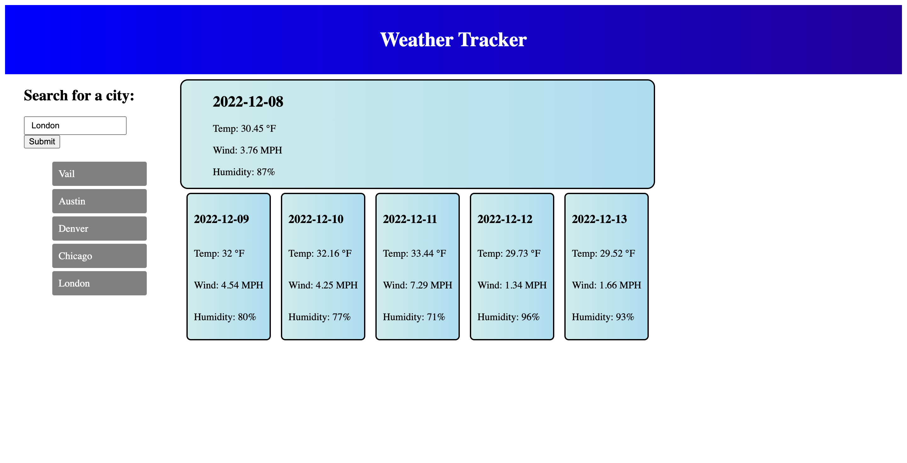

# Weather Tracker

## Description

The purpose of this project was to create a 5-day weather tracker. This project uses 2 web-APIs: Open Weather Map's Geocoding api to find the coordinates of a given location, and forecast5 api to find the weather forecast of the given location. Enter any city name into the website and the user will recieve a 5 day forecast including temperature, wind speeds, and humidity.

## Installation

Open the link in a browser.

## Usage

To use this website, the user will input any city name into the search bar to find that locations forecast

## Website Link

https://ryanstephens6.github.io/weather-tracker/

## Web APIs

https://openweathermap.org/forecast5
https://openweathermap.org/api/geocoding-api

## Screenshot of Website

## License

MIT License

Copyright (c) [2022] Ryan Stevens

Permission is hereby granted, free of charge, to any person obtaining a copy
of this software and associated documentation files (the "Software"), to deal
in the Software without restriction, including without limitation the rights
to use, copy, modify, merge, publish, distribute, sublicense, and/or sell
copies of the Software, and to permit persons to whom the Software is
furnished to do so, subject to the following conditions:

The above copyright notice and this permission notice shall be included in all
copies or substantial portions of the Software.

THE SOFTWARE IS PROVIDED "AS IS", WITHOUT WARRANTY OF ANY KIND, EXPRESS OR
IMPLIED, INCLUDING BUT NOT LIMITED TO THE WARRANTIES OF MERCHANTABILITY,
FITNESS FOR A PARTICULAR PURPOSE AND NONINFRINGEMENT. IN NO EVENT SHALL THE
AUTHORS OR COPYRIGHT HOLDERS BE LIABLE FOR ANY CLAIM, DAMAGES OR OTHER
LIABILITY, WHETHER IN AN ACTION OF CONTRACT, TORT OR OTHERWISE, ARISING FROM,
OUT OF OR IN CONNECTION WITH THE SOFTWARE OR THE USE OR OTHER DEALINGS IN THE
SOFTWARE.
